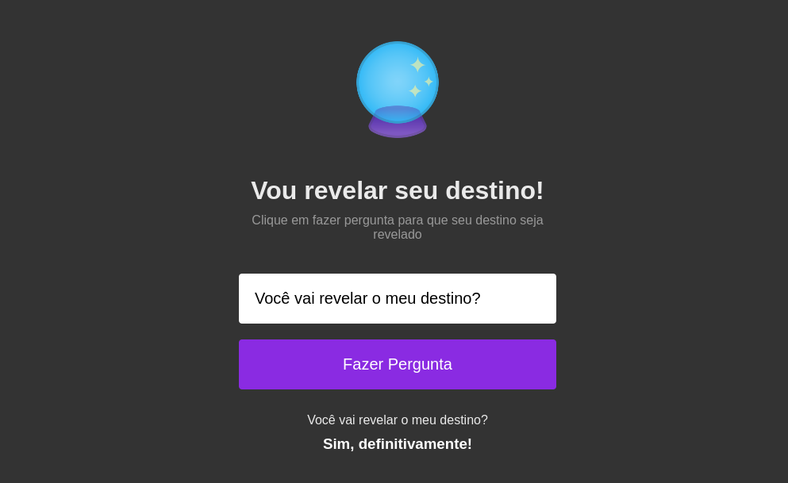

<table>
    <tr>
        <td>
			
		</td>
        <td>
            <h1 align="center"><b>Revelando seu Destino</b></h1>
        </td>
    </tr>
</table>

<p align="center">
  <a href="#-tecnologias">Tecnologias</a>&nbsp;&nbsp;&nbsp;|&nbsp;&nbsp;&nbsp;
  <a href="#-projeto">Projeto</a>&nbsp;&nbsp;&nbsp;|&nbsp;&nbsp;&nbsp;
  <a href="#-layout">Layout</a>&nbsp;&nbsp;&nbsp;|&nbsp;&nbsp;&nbsp;
  <a href="#-como-executar">Como executar</a>&nbsp;&nbsp;&nbsp;|&nbsp;&nbsp;&nbsp;
  <a href="#-licença">Licença</a>
</p>

# ✨ Tecnologias

- **HTML** (Hyper Text Markup Language)
- **CSS** (Cascading Style Sheets)
- **Javascript**

# 💻 Projeto

Esta aplicação tem o intuíto de apresentar respostas às perguntas realizadas. Ao realizar o envio da pergunta, de forma aleatória através de um código em javascript, é então apresentada uma resposta como forma de brincadeira para revelar o futuro.

# 🔖 Layout



# 🚀 Como executar

Para rodar localmente o projeto, clone o projeto utilizando o seguinte comando:

```
git clone ###
```

Utilizando a IDE: Visual Studio Code, baixe a extensão ```Live Server```, instalando e ativando esta extensão, o navegador padrão abrirá automaticamente com a aplicação rodando. 

Ou então se preferir, entre na pasta dos arquivos e acesse o arquivo ```index.html```, isso fará com que o arquivo em HTML seja aberto no navegador localmente já com as estilizações CSS e as functionalidades de Javascript funcionando normalmente.

# 📝 Licença

Projeto desenvolvido pela Rocketseat e apresentado na Maratona Explorer 1 (06/2022).
